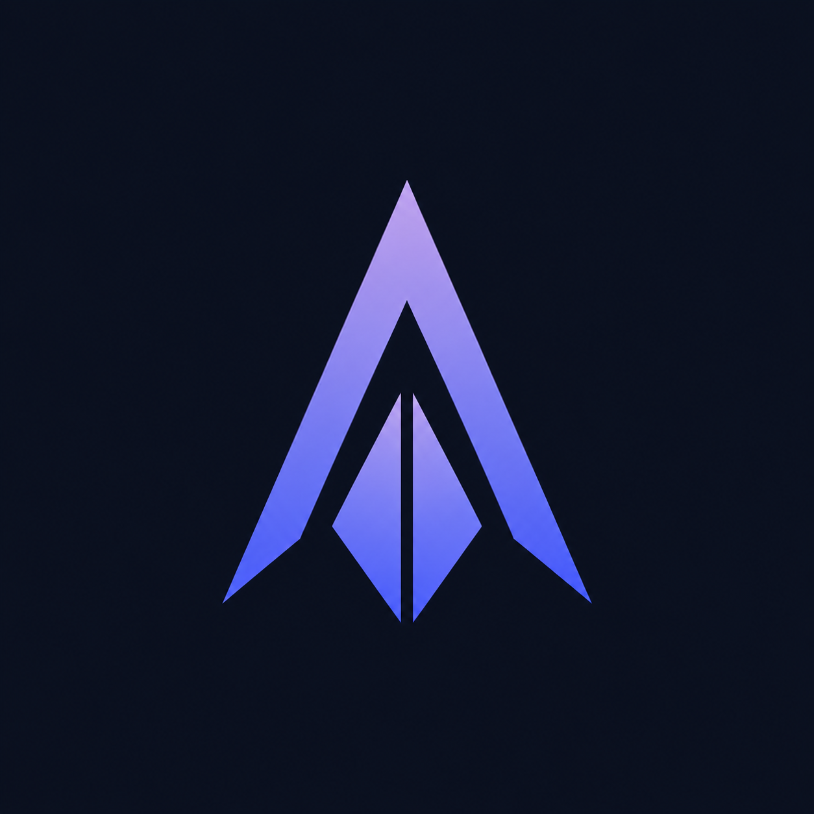
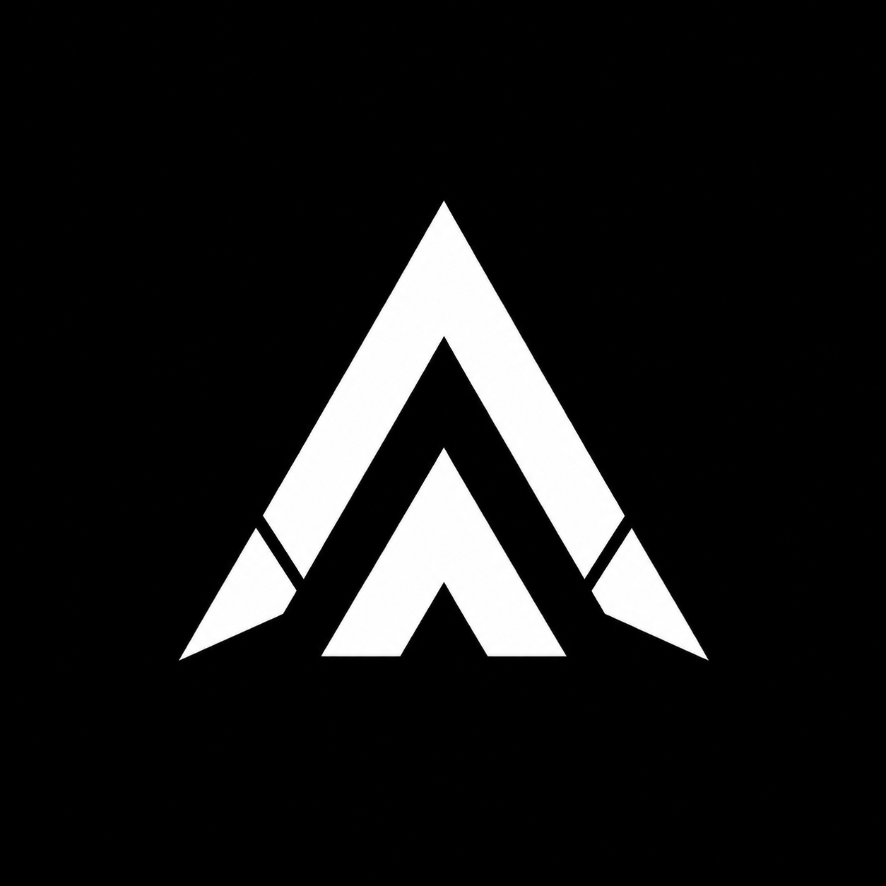

Building **Aetra** — a Proof-of-Stake blockchain with its own virtual machine
and a language for smart contracts. AI-assisted.

 

---

## 🧑‍💻 About Me

I'm 19. I build things end to end — web apps, smart contracts, and my own blockchain.
Most of my work is **AI-assisted**: I use AI as a co-developer.

---

## ⛓️ What I'm Building

<table>
<tr>
<td width="88" align="center" valign="middle">

</td>
<td valign="middle">

**[Aetra](https://github.com/Aetra-Network/Blockchain)** — a Proof-of-Stake blockchain
with its own virtual machine, the **AVM**.

</td>
</tr>
<tr>
<td width="88" align="center" valign="middle">

</td>
<td valign="middle">

**[Aetralis](https://github.com/Aetra-Network/Aetralis-Extension)** — a language for
writing smart contracts that run on the AVM.

</td>
</tr>
</table>

---

## 🛠️ Tech Stack

**Languages**

  

**Blockchain**

**Web3 · TON**

**Frontend**

  

**Backend**

  

**Tooling**

  

---

## 📊 GitHub

---

## 📫 Contact

- **GitHub:** [@SoftwareMaestro16](https://github.com/SoftwareMaestro16)
- **Telegram:** [@SoftwareMaestro](https://t.me/SoftwareMaestro)

